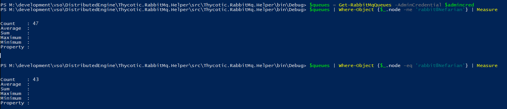

# Clustering

The RabbitMQ Helper is a tool that streamlines the RabbitMQ clustering process on Windows. See [Clustering Guide](https://www.rabbitmq.com/clustering.html) and [Highly Available (Mirrored) Queues](https://www.rabbitmq.com/ha.html) for vanilla instructions. 

> The Helper does not assist with load-balancing. See [Load Balancing](../loadbalancing.md) for details.

## Joining a Cluster

### Prerequisite Steps for Clustering
When RabbitMQ is installed on a virtual/physical machine, it is already in a cluster of one node. To add another node to the cluster, we simply need to install RabbitMQ on a different virtual/physical machine and then join either of nodes to the other's cluster. The cluster name is irrelevant and can be changed at a later time.

* To proceed, please be sure you have at least two RabbitMQ nodes already installed following the appropriate [installation process].(../installation/README.md)

* Ensure that all cluster nodes can resolve each others' IP addresses
* Install RabbitMQ on N+1 virtual/physical machines
* Open firewall for cluster ports 
    * Make sure the firewall rule is open for the network type (private/domain only) on each virtual/physical machine where RabbitMQ nodes will be installed.
    * TCP ports: 4369, 25672,44002
* Find the value for the Erlang cookie of Rabbit Service on the node that you are trying to join. Taken from: https://www.rabbitmq.com/clustering.html, repeating it here since it is relevant:

"With Erlang versions starting with 20.2, the cookie file locations are:
%HOMEDRIVE%%HOMEPATH%\.erlang.cookie (usually C:\Users\%USERNAME%\.erlang.cookie for user %USERNAME%) if both the HOMEDRIVE and HOMEPATH environment variables are set
%USERPROFILE%\.erlang.cookie (usually C:\Users\%USERNAME%\.erlang.cookie) if HOMEDRIVE and HOMEPATH are not both set

For the RabbitMQ Windows service - %USERPROFILE%\.erlang.cookie (usually C:\WINDOWS\system32\config\systemprofile)
The cookie file used by the Windows service account and the user running CLI tools must be synchronised.


On Erlang versions prior to 20.2 (e.g. 19.3 or 20.1), the cookie file locations are:
%HOMEDRIVE%%HOMEPATH%\.erlang.cookie (usually C:\Users\%USERNAME%\.erlang.cookie for user %USERNAME%) if both the HOMEDRIVE and HOMEPATH environment variables are set
%USERPROFILE%\.erlang.cookie (usually C:\Users\%USERNAME%\.erlang.cookie) if HOMEDRIVE and HOMEPATH are not both set

For the RabbitMQ Windows service - %WINDIR%\.erlang.cookie (usually C:\Windows\.erlang.cookie)
The cookie file used by the Windows service account and the user running CLI tools must be synchronised." 

Usually, the cookie will be located in C:\WINDOWS\system32\config\systemprofile OR C:\WINDOWS\system32\config\systemprofile

That cookie value is the shared secret for the cluster, so all nodes which will be joined to the cluster must use this shared secret. Retrieve the value out of the cookie in the above location from the node you are trying to join so that you can use it with the Set-ErlangCookieFileCommand on another node. The other node will have its erlang cookie set to match the first node and the clustering commands will be used to join the other node to the first node. It will then be brought into mirror with the first node.

### Overview of Steps to Join Cluster Using the Helper
* ```Set-ErlangCookieFileCommand``` - Set the system and user profile cookie to the cookie of the Rabbit service on the node you are joining. See prerequisite step above.
    * You can alternatively use the same command with an arbitrary cookie on all nodes (if you want to use a new value or cannot look the existing one up).
* ```Join-RabbitMqCluster``` - Join the other node in a cluster
* Please review the 'Overview of Establishing a Cluster Policy'. It is likely that you will want to establish policies to replicate your queues. While the above to commands are enough to join two nodes to a cluster, that cluster will not replicate queues without policies.

### Example Powershell to Join a Cluster
```powershell
#on the node which you are joining into the target node/cluster

#Use the value for cookie from the target node, collected in the prerequisite steps.
Set-ErlangCookieFileCommand -CookieContent MYCUSTOMSECURECOOKIE -Verbose

#using the CookieSet and FirewallConfigured will prevent the helper for prompting. Only use if you have actually already set the cluster cookie and you have configured your firewall
# OTHERHOSTNAME is CASE SENSITIVE and is the exact hostname of a machine that you are trying to join this machine into a cluster with.
Join-RabbitMqCluster -StrictHostname OTHERHOSTNAME -CookieSet -FirewallConfigured -Verbose
```

### Alternate Steps to Cluster a Rabbit Node Without the Helper
* Copy the .erlang.cookie from one node to all nodes in the system profile (usually C:\Windows\System32\config\systemprofile\) and the user profile running rabbitmqctl.bat
* Restart RabbitMQ
```cmd
REM on the node to join
rabbitmqctl stop_app 
rabbitmqctl join_cluster rabbit@OTHERHOSTNAME
rabbitmqctl start_app
```

## Overview of Establishing a Cluster Policy

Being part of a cluster isn't enough to achieve High Availability. Clusters do not mirror queues unless they are configured to do so via policies.

> The helper creates balanced policies by default using ```queue-master-locator: min-masters```. This enables queues to be evenly distributed to all nodes in the cluster.

#### Non-Balanced

Even though the node is in a two-node cluster, all queues have it as primary. Therefore, the other nodes are not helping with the load even though they may have mirrors of those queues.


#### Min-Masters

Because the node is in a two-node cluster, the queues are evenly distributed inside the cluster. Almost half use one node as their primary and vise versa.



### Overview of Steps to Set Cluster Policy Using the Helper

* ```Set-RabbitMqBalancedClusterPolicy``` - creates a balanced cluster policy that distributes queues evenly around the cluster nodes
* The -Name arguement sets the policy name. It must be unique.
* The '-Pattern' argument sets a pattern to match at the beginning of the queue name. If the pattern is matched, the queue is replicated. For example, "^ActiveNonSslRabbitMq:" would match a queue that begins with 'ActiveNonSslRabbitMq:' and would replicate that queue across the cluster.

### Example Powershell to Set Cluster Policy
```powershell
$admincred = Get-Credential -Message "Enter the administrative user RabbitMq user username and password";

Set-RabbitMqBalancedClusterPolicy -Name cluster-test-all -Pattern "^ActiveNonSslRabbitMq:" -AdminCredential $admincred

# you can create a policy with a custom sync batch size. The default is 400 for Set-RabbitMqBalancedClusterPolicy because Thycotic products have a worst case scenario size for messages to be at 256KB. When a sync message is generated 256*400 = 100MB. Larger sync message can cause fragementation if there is latency or network connection drops between cluster node. Alter as needed
Set-RabbitMqBalancedClusterPolicy -Name cluster-test-all -Pattern "^ActiveNonSslRabbitMq:" -AdminCredential $admincred -SyncBatchSize 100

# you can create a policy with a custom replica count batch size. The default is 2 for Set-RabbitMqBalancedClusterPolicy because anything higher puts strain on the cluster. 
# 2 replicas means 1 master and 1 mirror. Alter as needed
Set-RabbitMqBalancedClusterPolicy -Name cluster-test-all -Pattern "^ActiveNonSslRabbitMq:" -AdminCredential $admincred -QueueReplicaCount 3

# you can create a policy with automatic sync mode. The default for Set-RabbitMqBalancedClusterPolicy is manual to avoid forcing a queue to automatically synchronize when a new mirror joins.
Set-RabbitMqBalancedClusterPolicy -Name cluster-test-all -Pattern "^ActiveNonSslRabbitMq:" -AdminCredential $admincred -AutomaticSyncMode

# you can create a policy with a combination of policy definitions
Set-RabbitMqBalancedClusterPolicy -Name cluster-test-all -Pattern "^ActiveNonSslRabbitMq:" -AdminCredential $admincred -SyncBatchSize 100 -QueueReplicaCount 3 -AutomaticSyncMode

```

### Alternate Steps to Establish Policy Without the Helper
```cmd
REM this policy is not ideal and is not balanced. Please use the helper if possible
rabbitmqctl set_policy cluster-test-all "^cluster\-test:" "{""ha-mode"":""all""}"
```


## Overview of Leaving a Cluster

> WARNING: The Helper uses ```reset``` to leave clusters. This removes the node from any cluster it belongs to, removes all data from the management database (such as configured users and vhosts), and deletes all persistent messages.

### Steps to Remove a Node from a Rabbit Cluster Using the Helper

* ```Reset-RabbitMqNodeCommand``` - resets the RabbitMq node to mint condition

```powershell
Reset-RabbitMqNodeCommand
```

### Alternate Steps to Remove a Node from a Rabbit Cluster Without the Helper
```cmd
rabbitmqctl reset
```

