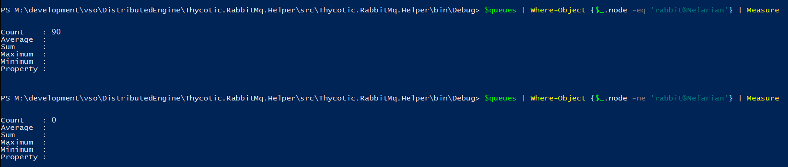

# Clustering

The RabbitMq Helper is a tool that streamlines the RabbitMq clustering process on Windows. See [Clustering Guide](https://www.rabbitmq.com/clustering.html) and [Highly Available (Mirrored) Queues](https://www.rabbitmq.com/ha.html) for vanilla instructions. 

> The helper does not assist with load-balancing. See [Load balancing](../loadbalancing.md) for details.

## Clustering workflow

When RabbitMq is installed on a virtual/physical machine, it is already in a cluster of one node. To add another node to the cluster, we simply need to install RabbitMq on a different virtual/physical machine and then join either of nodes to the other's cluster. The cluster name is irrelevant and can be changed at a later time.

> To proceed, please be sure you have at least two RabbitMq node already installed following the appropriate [installation](../installation/README.md)

## Joining a cluster

### Preliminary steps
* Ensure that all cluster nodes can resolve each others' IP addresses
* Install RabbitMq on N+1 virtual/physical machines
* Open firewall for cluster ports. 
    * Make sure the firewall rule is open for the network type (private/domain only) on each virtual/physical machine where RabbitMq nodes will be installed.
    * TCP ports: 4369, 25672,44002


### Steps using the helper
* ```Set-ErlangCookieFileCommand``` - Set the system and user profile cookie to the cookie of the node your joining
    * You can alternatively use the same command with an arbitrary cookie on all nodes that will be in the cluster should like to use a new value or cannot look it up
* ```Join-RabbitMqCluster``` - Join the other node in a cluster

```powershell
#on the node to join

#obviously use your own custom character cookie and not this value!
Set-ErlangCookieFileCommand -CookieContent MYCUSTOMSECURECOOKIE -Verbose

#using the CookieSet and FirewallConfigured will prevent the helper for prompting. Only use if you have actually already set the cluster cookie and you have configured your firewall
# OTHERHOSTNAME HAS TO MATCH the machine hostname exactly to what the the machine thinks it is
Join-RabbitMqCluster -StrictHostname OTHERHOSTNAME -CookieSet -FirewallConfigured -Verbose
```

### Alternate steps without the helper
* Copy the .erlang.cookie from one node to all nodes in the system profile (usually C:\Windows\System32\config\systemprofile\) and the user profile running rabbitmqctl.bat
* Restart RabbitMq
```cmd
REM on the node to join
rabbitmqctl stop_app 
rabbitmqctl join_cluster rabbit@OTHERHOSTNAME
rabbitmqctl start_app
```

## Leaving a cluster

> WARNING: The helper uses ```reset``` to leave clusters. Removes the node from any cluster it belongs to, removes all data from the management database, such as configured users and vhosts, and deletes all persistent messages.

### Steps using the helper

* ```Reset-RabbitMqNodeCommand``` - resets the RabbitMq node to mint condition

```powershell
Reset-RabbitMqNodeCommand
```

### Alternate steps without the helper
```cmd
rabbitmqctl reset
```

## Establishing a cluster policy

Being part of a cluster isn't enough to achieve High Availability. Clusters do not mirror queues unless they are configured to do so via policies.

> The helper creates balanced policies by default using ```queue-master-locator: min-masters```. This enables queues to be evenly distributed to all nodes in the cluster.

#### Non-balanced

Even though the node is in a two-node cluster, all queues have it as primary. Therefore, the other nodes are not helping with the load even though they may have mirrors of those queues.



#### Min-masters

Because the node is in a two-node cluster, the queues are evenly distributed inside the cluster. Almost half use one node as their primary and vise versa.


### Steps using the helper

* ```Set-RabbitMqBalancedClusterPolicy``` - creates a balanced cluster policy that distributes queues evenly around the cluster nodes

```powershell
$admincred = Get-Credential -Message "Enter the administrative user RabbitMq user username and password";

Set-RabbitMqBalancedClusterPolicy -Name cluster-test-all -Pattern "^ActiveNonSslRabbitMq:" -AdminCredential $admincred

# you can create a policy with a custom sync batch size. The default is 400 for Set-RabbitMqBalancedClusterPolicy because Thycotic products have a worst case scenario size for messages to be at 256KB. When a sync message is generated 256*400 = 100MB. Larger sync message can cause fragementation if there is latency or network connection drops between cluster node. Alter as needed
Set-RabbitMqBalancedClusterPolicy -Name cluster-test-all -Pattern "^ActiveNonSslRabbitMq:" -AdminCredential $admincred -SyncBatchSize 100

# you can create a policy with a custom replica count batch size. The default is 2 for Set-RabbitMqBalancedClusterPolicy because anything higher puts strain on the cluster. 
# 2 replicas means 1 master and 1 mirror. Alter as needed
Set-RabbitMqBalancedClusterPolicy -Name cluster-test-all -Pattern "^ActiveNonSslRabbitMq:" -AdminCredential $admincred -QueueReplicaCount 3

# you can create a policy with automatic sync mode. The default for Set-RabbitMqBalancedClusterPolicy is manual to avoid forcing a queue to automatically synchronize when a new mirror joins.
Set-RabbitMqBalancedClusterPolicy -Name cluster-test-all -Pattern "^ActiveNonSslRabbitMq:" -AdminCredential $admincred -AutomaticSyncMode

# you can create a policy with a combination of policy definitions
Set-RabbitMqBalancedClusterPolicy -Name cluster-test-all -Pattern "^ActiveNonSslRabbitMq:" -AdminCredential $admincred -SyncBatchSize 100 -QueueReplicaCount 3 -AutomaticSyncMode

```


### Alternate steps without the helper
```cmd
REM this policy is not ideal and is not balanced. Please use the helper if possible
rabbitmqctl set_policy cluster-test-all "^cluster\-test:" "{""ha-mode"":""all""}"
```


